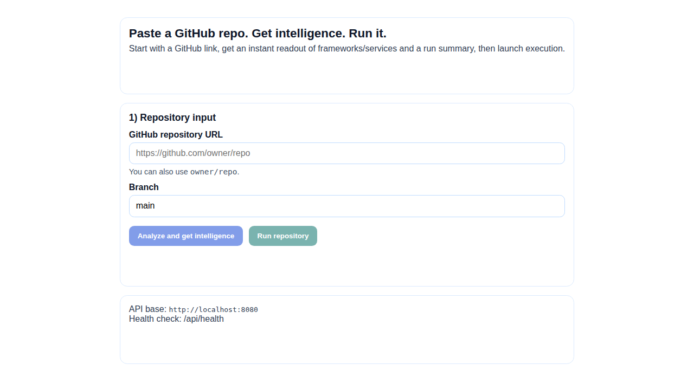
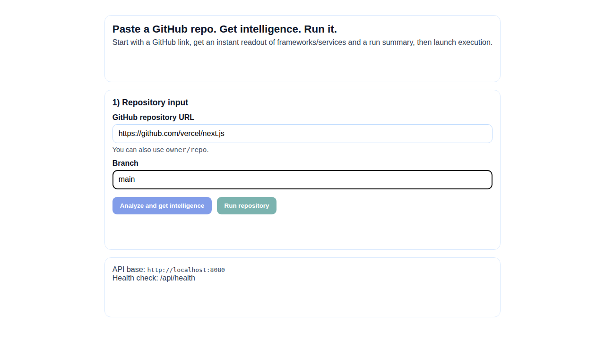
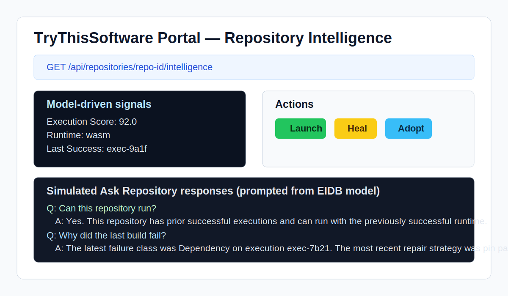
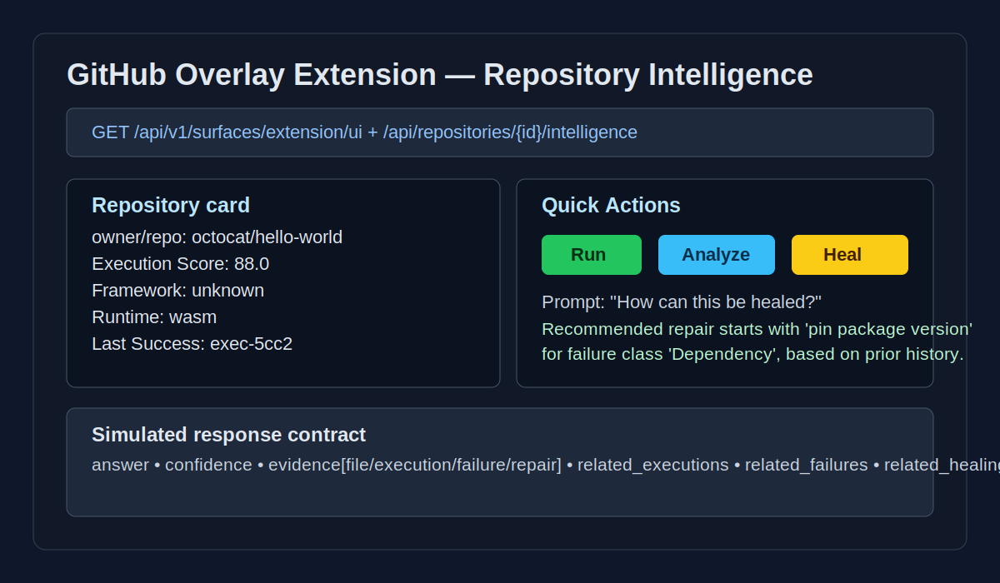

# rustgit-

A Rust foundation for a Gitpod-compatible WebAssembly workspace runtime.

## What is included

- Repository lifecycle primitives (clone/materialize, analyze, execution planning, caching)
- Workspace runtime API (`WasmWorkspace`) with launch/stop/restart/logs/filesystem/ports
- Execution router + provider model (`ExecutionRouter`, `ExecutionProvider`) for WASM/native/static substrates
- Execution substrate foundation (`WasmRuntimeEngine`, `NativeRuntimeEngine`, `HybridExecutionBridge`) for concrete runtime dispatch
- Virtual filesystem with snapshot + restore
- Network policy and resource quota structures for sandbox controls
- REST API route surface definition (`RestApiSpec`)
- Example CLI (`wasm-workspace-cli`)

## Dual Surface Experience (DSE)

TryThisSoftware is modeled as one product with two entry surfaces:

- **GitHub Overlay Extension** (activation surface): discover repositories on GitHub and launch runs quickly.
- **TryThisSoftware Portal** (management surface): monitor workspaces, executions, logs, URLs, and agents.

Both surfaces route through the same backend primitives:

- Shared **Execution API** (`/api/v1/executions`)
- Shared **Control Plane**
- Shared execution IDs, URLs, and runtime state

Surface UI contracts are rendered through a shared Surface Rendering System (SRS):

- Shared TryThisSoftware design system component model
- Shared component registry for contract-to-component mapping
- Unified renderer output for Portal shell and GitHub overlay shell

## README badge execution + healing loop

The API surface now includes a badge-driven execution seed flow:

- `POST /api/badges/generate` — portal badge generator for markdown, HTML, badge URL, and seed trigger snippets
- `GET /badge/{owner}/{repo}.svg` — dynamic runtime status badge (untested / runnable / verified / healed / production ready)
- `GET /badge/healed/{owner}/{repo}.svg` — healed badge variant
- `GET /seed/{owner}/{repo}` — badge click bootstrap into anonymous execution + analyze/plan/start pipeline
- `GET /api/repositories/{id}/intelligence` — repository intelligence panel data (execution score, runtime, launch/heal/adopt actions)

Example badge embed:

```html
<a href="https://trythissoftware.com/seed/{owner}/{repo}">
  
</a>
```

Badge screenshots:


This badge updates automatically based on repository execution health.

## Repository intelligence (current state)

### What we have

- **Repository knowledge graph assembly** from execution, failure, healing, temporal recovery, dependency, and architecture data.
- **Repository ask service** (`POST /api/repositories/{id}/ask`) that builds an answer with confidence and evidence links.
- **Repository intelligence panel endpoint** (`GET /api/repositories/{id}/intelligence`) used by product surfaces for score/runtime/action summaries.
- **Execution intelligence loop endpoints** for retrieval, learning, and optimization:
  - `GET /intelligence/{execution}`
  - `GET /intelligence/similar`
  - `GET /intelligence/patterns`
  - `GET /intelligence/repairs`
  - `GET /intelligence/context`
  - `POST /intelligence/retrieve`
  - `POST /intelligence/learn`
  - `POST /intelligence/optimize`

### What it does

- Aggregates repository history into an execution-aware context.
- Uses prior outcomes to surface similar executions and repair patterns.
- Produces operator-facing summaries (execution score, healing score, runtime, last success, recommended actions).
- Tracks evidence categories for answers (`file`, `execution`, `failure`, `repair`) so responses can be grounded in observed signals.

### What we can currently determine

- Whether a repository has demonstrated successful execution history.
- The most recent failure class and latest known repair strategy.
- The best observed runtime tier by success ratio.
- A compact health snapshot: execution count, failure count, healing count, and recovery snapshots.

### Opportunities to deepen intelligence

- Replace current keyword/rule-based answer routing with richer semantic retrieval and question intent handling.
- Enrich embeddings and intelligence records with inferred language/framework/runtime metadata (currently defaulted to `unknown` in several learning paths).
- Expand code context beyond root config files to include service boundaries, dependency hotspots, and ownership/churn signals.
- Add trend and anomaly intelligence (failure drift, runtime regressions, repair success decay) across time windows.
- Improve confidence scoring calibration with source-weighted signals and explicit uncertainty reasoning.

## Universal Software Intelligence Layer (USIL)

Tagline: **Every repository becomes a queryable, executable, continuously learning software object.**

### Global Software Intelligence Network (GSIN)

USIL now extends to a network model where repository-level learning contributes to global software intelligence.

Current evolution:

`Git Repository → Repository Intelligence → Repository Cognitive Twin → Software Object`

Next evolution:

`Software Objects (many) → Global Knowledge Graph → Collective Intelligence → Universal Reasoning`

Core first-class graph nodes include:

- Repository
- Service
- Dependency
- Runtime
- Framework
- API
- Database
- Package
- Execution
- Failure
- Repair
- Optimization
- Developer Action
- Deployment
- Architecture Pattern

GSIN capabilities:

- **Universal pattern mining** across framework/runtime/dependency combinations and outcomes.
- **Autonomous architecture intelligence** that infers architecture from behavior (microservice, clean, event-driven, CQRS, monolith, serverless, hybrid, edge-native).
- **Global healing network**: failure similarity search → prior successful repairs → confidence ranking → automated verification loop.
- **Software evolution modeling** over lifecycle stages (creation, growth, refactor, migration, split, optimization, stabilization).
- **Predictive architecture guidance** for dependency drift, runtime impact, and execution risk before failures occur.
- **Cross-repository reasoning** for reliability, migration, scaling, and optimization decisions.

### Platform primitive shift

`Repository` is the current primitive. USIL evolves that into a first-class `SoftwareObject` that unifies:

- Source code + architecture
- Runtime + execution/healing history
- Dependency/service/API graphs
- Temporal history + ownership
- Memory + intelligence + recommendations + predictions
- Live state

### Unified object model

Rather than split intelligence across isolated stores, USIL standardizes on a single software object interface:

Accessors use `get*` and lifecycle/intelligence operations use action verbs.

- `.getExecution()`
- `.getArchitecture()`
- `.getRuntime()`
- `.getDependencies()`
- `.getHistory()`
- `.predict()`
- `.heal()`
- `.optimize()`
- `.execute()`
- `.ask()`
- `.compare()`
- `.explain()`
- `.simulate()`
- `.recover()`
- `.search()`
- `.timeline()`

### Current capability trajectory

- Repository Analysis ✅
- Execution ✅
- Runtime Routing ✅
- Healing ◐
- Repository Intelligence ◐
- Portal ◐
- Extension ◐

USIL is the umbrella direction that links these capabilities into one shared live model for the portal, extension, API, CLI, and agents.

### Planned USIL engines

- **Live Runtime Mirror**: running executions continuously update the same software object state used by all product surfaces.
- **Universal Query Engine**: one query language across repository, runtime, graph, and healing signals.
- **Execution Replay**: replay, diff, and compare prior executions ("git bisect" for runtime behavior).
- **Continuous Runtime Observatory**: learn best runtime/cache/healing/dependency outcomes from every execution.
- **Software Similarity Engine**: compare systems by architecture + behavior + dependencies + performance + topology.
- **Autonomous Optimization Engine**: continuously propose and validate faster/cheaper/more reliable execution plans.
- **Multi-Repository Reasoning**: infer recommendations from cross-repository patterns.
- **Live Architecture + Universal Timeline**: one graph and one causal timeline for commits, executions, healing, deploys, and regressions.
- **Cognitive Agent API**: expose software object actions (`predict`, `execute`, `heal`, `optimize`, `compare`, `explain`, `simulate`, `recover`, `search`, `timeline`) to any agent client.

### Universal Software Graph API

All software objects share one queryable interface:

- `software.find()`
- `software.compare()`
- `software.predict()`
- `software.simulate()`
- `software.optimize()`
- `software.heal()`
- `software.evolve()`
- `software.explain()`
- `software.recommend()`

## Repository cognition (RCIE)

The API now also exposes a cognitive repository model surface:

- `GET /repositories/{id}/twin`
- `GET /repositories/{id}/behavior`
- `GET /repositories/{id}/architecture`
- `GET /repositories/{id}/timeline`
- `GET /repositories/{id}/predictions`
- `GET /repositories/{id}/recommendations`
- `GET /repositories/{id}/blast-radius`
- `GET /repositories/{id}/dna`
- `GET /repositories/{id}/risk`
- `GET /repositories/{id}/memory`
- `POST /repositories/{id}/simulate`
- `POST /repositories/{id}/infer`
- `POST /repositories/{id}/compare`
- `POST /repositories/{id}/predict`
- `POST /repositories/{id}/explain`

These endpoints provide a repository digital twin view, behavior signals, risk projections, and intent-oriented inference actions on top of the existing execution intelligence loop.

## User journey screenshots

End-to-end GitHub-native execution flywheel journey:

1) Visit GitHub repository and see the TryThisSoftware badge  


2) Click badge to launch via `/seed/{owner}/{repo}`  


3) Heal failures with classify → repair → validate flow  


4) Adopt the healed workspace  


5) Publish runtime and republish a stronger badge state  


## Quick start

```bash
cargo test
cargo run --bin wasm-workspace-cli -- launch /absolute/path/to/repo
```

## Portal (Next.js)

The management portal now lives in `./portal` as a standalone Next.js app.

```bash
cd portal
npm install
npm run dev
```

### Local platform development

Run the API and portal together in separate terminals:

```bash
# Terminal 1 (API)
cargo run --bin server

# Terminal 2 (Portal)
cd portal
npm install
npm run dev
```

By default, the portal uses `http://localhost:8080` for API requests in development.

Production/Fly deploy for the portal uses `portal/Dockerfile` through `deploy/fly/portal.fly.toml`.

Portal screenshots:





Dual-surface intelligence screenshots (simulated from current data model + prompting behavior):




## PostgreSQL persistence

This repository now includes SQL migrations and a production-style PostgreSQL persistence layer for Execution Intelligence history.

### Migrations

Migrations are stored in `./migrations`:

- `0001_baseline_schema.sql` — core tables, PK/FK constraints, nullable rules, and check constraints
- `0002_indexes_and_constraints.sql` — performance indexes and uniqueness constraints
- `0003_seed_bootstrap.sql` — bootstrap seed rows

`ExecutionIntelligencePostgresStore::initialize()` runs migrations on startup and records applied versions in `schema_migrations`.

### Environment variables

- `DATABASE_URL` (required for runtime Postgres initialization)
- `RUSTGIT_EIDB_TEST_DATABASE_URL` (optional, used by integration tests in `tests/postgres_persistence.rs`)

## Production deployment and domain mapping

The production domain hierarchy is now unified under `trythissoftware.com`:

- Portal: `https://trythissoftware.com`
- API / extension backend: `https://api.trythissoftware.com`
- Workspace runtime: `https://workspace-{id}.trythissoftware.com`

Fly.io app configs are checked in under `deploy/fly/`:

- `api.fly.toml` (`trythissoftware-api`)
- `portal.fly.toml` (`trythissoftware-portal`)
- `workspaces.fly.toml` (`trythissoftware-workspaces`)
- `postgres.fly.toml` (`trythissoftware-db`) — self-managed Postgres, runs on Fly's private network

The repository root `fly.toml` is intentionally configured for the frontend (`rustgit` app) and uses `portal/Dockerfile` so a plain `fly deploy` from repo root serves `trythissoftware.com`.

Required runtime environment variables:

- API: `DATABASE_URL`, `REDIS_URL` (optional), `GITHUB_CLIENT_ID`, `GITHUB_CLIENT_SECRET`, `JWT_SECRET`, `BASE_DOMAIN=trythissoftware.com`
- Portal: `NEXT_PUBLIC_API_URL=https://api.trythissoftware.com`, `NEXT_PUBLIC_BASE_DOMAIN=trythissoftware.com`

OAuth callback endpoints (API):

- `GET https://api.trythissoftware.com/auth/github/callback`
- `GET https://api.trythissoftware.com/auth/google/callback`

Store API credentials/secrets as Fly secrets instead of committing them to config files:

```bash
# Deploy Postgres first
fly deploy --config deploy/fly/postgres.fly.toml

# Set the DATABASE_URL pointing to Fly's private network (.flycast)
fly secrets set --app trythissoftware-api \
  DATABASE_URL="postgresql://postgres:<password>@trythissoftware-db.flycast:5432/rustgit" \
  GITHUB_CLIENT_ID=<your-github-client-id> \
  GITHUB_CLIENT_SECRET=<your-github-client-secret> \
  JWT_SECRET=<your-jwt-secret>

# Deploy the API
fly deploy --config deploy/fly/api.fly.toml
```

`POSTGRES_PASSWORD` must be set as a secret on the Postgres app before first deploy:

```bash
fly secrets set --app trythissoftware-db POSTGRES_PASSWORD=<password>
```

### Local initialization example

```bash
docker run --name rustgit-postgres -e POSTGRES_PASSWORD=postgres -e POSTGRES_DB=rustgit -p 5432:5432 -d postgres:17
export DATABASE_URL=postgresql://<username>:<password>@localhost:5432/rustgit
cargo test
```
